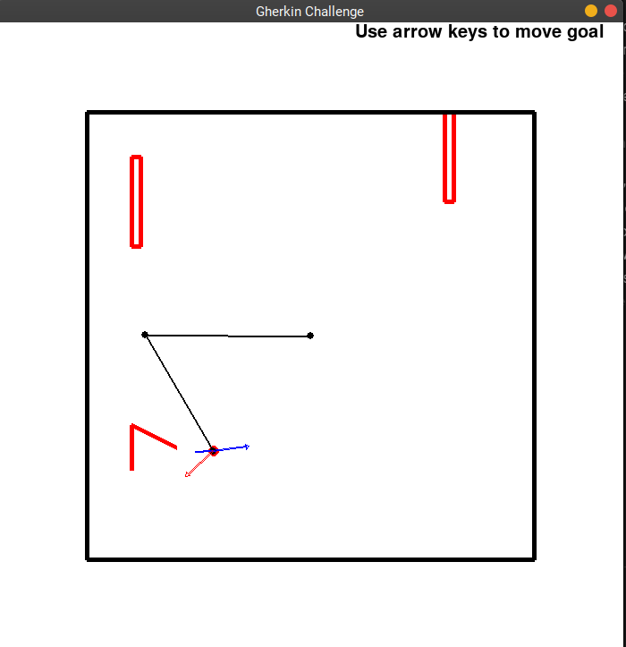
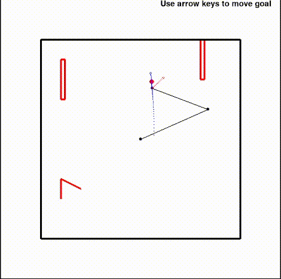
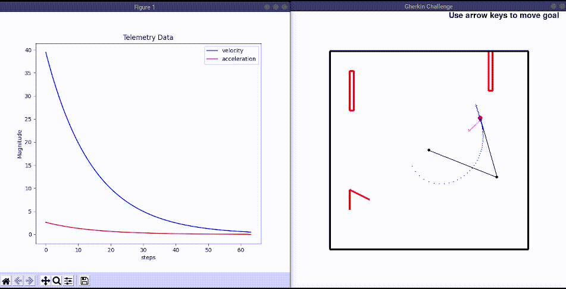
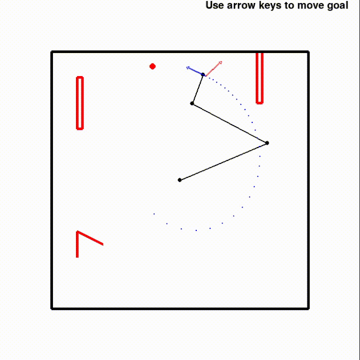

# Robotic Arm Code


### Known Good Platforms

| OS     | Versions |
|--------|----------|
| Ubuntu | 18.04    |


### Setup the Development Environment

```
$ ./scripts/bootstrap
```

### Enter the virtual environment

```
$ source ./scripts/init
```

### Run

```
$ python challenge.py
```


## Backlog

* Add borders and wall to the world
  * Bonus: make a more easily configurable representation
* Add a third link to the arm
* Make a moving goal
* Improve the visualization implementation
* Visualize Paths, Velocities, Accelerations, over time in the sandbox window
  * Note: Not as good to render several separate visualizations
* "Cloudify" the arm's configuration
* Use [py-trees](https://py-trees.readthedocs.io/en/devel/) to make complex behaviors
* Add unit tests and clean up the code (note: don't just do this item!)
* Change system from top down to on the wall - add gravity!
  * This will require changing the arm to use torque control
* Replace the controller with a learned policy


## Code
In this challenge I tackled the following backlogs:

### Borders, walls and obstacles
Borders are added to the world as lines in pygame (almost like a bounding box to the robot workspace!). They border takes the shape of the sandbox window but "offset" inwards on each side. This is set by the variable ```wall_padding```  
Obstacles are set in the ```World``` class by defining the vertices of the obstacle (they may take any shape as defined by the vertex points)  

<p align="center">
  
</p>

### Moving Goal
At any point in the simulation, the goal can be moved around the screen using the arrow keys. the arm will accordingly change its path to reach the new goal.  
Once the arm reaches the goal, a new randomized goal will be generated for the arm to reach.  
*Note - in both the cases the program makes sure the "new goal" generated is within the workspace and the arm will not hit an obstacle while moving toward the new goal.*
<p align="center">
  
</p>

### Visualization Implementation
More functions were defined in the ```Visualizer``` class to draw arrows, paths and display the telemetry data. These functions are called as per requirement in the ```update_display``` function.

### Collision Checking
Before moving towards a goal, the arms trajectory is calculated. If at any point in the trajectory, either arm is intersecting any obstacle, that trajectory is rejected and another goal is requested. Synonymously, if the goal is moved into an obstacle using the arrow keys, the previous goal will be reinstated.  
This is performed by checking if 2 lines are intersecting or not.  
**TODO - implement RRT/A star to navigate the arm around an obstacle to reach the goal**

### Visualize Paths, Velocities and Accelerations
The ```Telemetry``` class stores all information of the arm such as current position, velocity and acceleration. As the arm moves from its current position towards the goal, each waypoint is plotted on the screen (blue dots). the arms velocity is calculated by taking the time derivative of the position equation. Finally the acceleration is calculated by finding the difference matrix of the velocity at every time step.  


<p align="center">
  
</p>

Alongside the sandbox window, the magnitude of the velocity and acceleration vs the number of steps is plotted in realtime as the arm moves towards the goal. Once the arm reaches the goal, the graph resets and plots the velocities and accelerations for the new trajectory.  
To make the visualization more intuitive, arrows located at the arms end effector represent the velocity and acceleration vectors where the size of the arrow is the magnitude and the direction of the vector is the direction in which the arrow is pointing.


### Third Link
Added a third link to the arm. The inverse kinematics calculations now change slightly as the end effector pose is to be given as a query as well. To keep things dynamic, the end effector pose is estimated by the slope of the line joining the goal and the robot origin. To solve for the edge cases/boundary conditions, the pose of the end effector is reduced by ```pi/10``` each iteration till a valid solution is reached.  
Collision checking and obstacle detection is taken into consideration for all 3 links.

*Note - here I assume the robot arms to be non-intersecting so they can move over one another to reach the goal*
<p align="center">
  
</p>